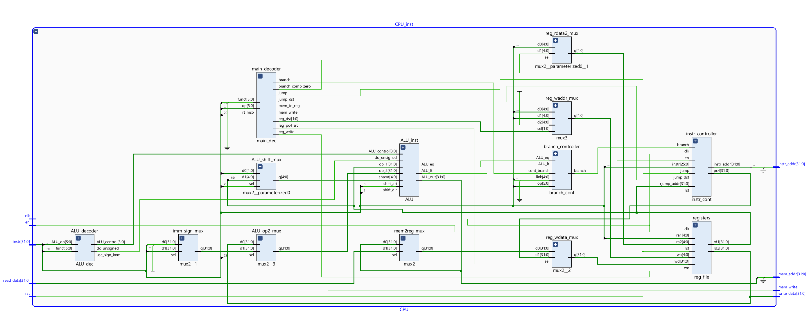

# CS202/CS214 Computer Organization Project

## Acknowledgements

You can find acknowledgements to the sources of image/video resources and assets used under `./acknowledgements.md`.

## Specification of Custom Formats

You can find the specification of customized formats under `./doc` folder.

## Introduction

In this project, a single-cycle MIPS CPU has been designed and tested. The CPU supports a subset of the MIPS32 ISA (without support for instructions related to exception handling, coprocessor 0 and multiplier/divider).

## CPU Specification

### Overview

**Architecture**: Harvard Architecture.

### List of Submodules

| Module Name         | Module Definition | Description                                                  | I/O  |
| ------------------- | ----------------- | ------------------------------------------------------------ | ---- |
| `ALU_decoder`       | `ALU_dec.sv`      | Decoder parsing instructions into ALU control signals, including `ALU_op`, parameters to control `shift`, unsigned operations, use of signed/unsigned immediate, source of the `ALU` operand. |      |
| `imm_sign_mux`      | `mux2.sv`         | Select between the signed immediate and the unsigned immediate, determined by `use_sign_imm` signal from `ALU_decoder`. |      |
| `ALU_op2_mux`       | `mux2.sv`         | Select the secondary operand of `ALU` between the register value and the immediate, determined by `ALU_sc`. |      |
| `ALU_shift_mux`     | `mux2.sv`         | Select the source for `shift amount` for ALU.  Either from `shamt` field of the instruction, or from `rs`. |      |
| `main_decoder`      | `main_dec.sv`     | Decoding the instruction and set various fields, including `branch`, `branch_comp_zero` (*used in branches that compares to zero but has a different field other than `5'b00000` in `rt`*), `jump`, `jump_dst` (*used if jump to an address specified in a register*), `mem_to_reg`, `mem_write`, `reg_dst` (*select the write address of the register file. Used to select between `rt`, `rd` and `$ra` (used for linking)*), `reg_pc4_src` (*for linking*), `reg_write`, etc. |      |
| `ALU_inst`          | `ALU.sv`          | ALU for processing various kind of operations.               |      |
| `reg_rdata2_mux`    | `mux2.sv`         | Select between `$zero` and `$rt`. Used in branching instructions. |      |
| `reg_waddr_mux`     | `mux3.sv`         | Select between different write addresses. Used in branching, jumping and linking. |      |
| `branch_controller` | `branch_cont.sv`  | Used to control the branch behavior, based on `ALU_lt` and `ALU_eq` which are two ALU facilities for comparing its operands. |      |
| `instr_controller`  | `instr_cont.sv`   | Used to control the instruction flow. Accepts `jump` and `branch` signals, and determine whether to jump/branch according to `main_decoder` and `branch_controller`. `instr_addr` outputs the address of the instruction to fetch, and `pc4` outputs the value of current `PC` +4 (*for linking purposes*). |      |
| `registers`         | `reg_file.sv`     | Register files. Has a reset button to reset contents to their default values. |      |

*For detailed I/O specification on each submodule, please refer to the schematic image. The naming convention is designed to be easy to read.*

### List of Supported Instructions (ISA)

This is a subset of the MIPS32 instruction set. Exclusions are `mul/div` and coprocessor-0-related instructions.

| Type           | Instruction               | Additional Description |
| -------------- | ------------------------- | ---------------------- |
| Logical        | `and rd, rs, rt`          |                        |
|                | `or rd, rs, rt`           |                        |
|                | `xor rd, rs, rt`          |                        |
|                | `nor rd, rs, rt`          |                        |
| Logical-IMM    | `andi rt, rs, immediate`  |                        |
|                | `xori rt, rs, immediate`  |                        |
|                | `lui rt, immediate`       |                        |
|                | `ori rs, rt, immediate`   |                        |
| Shift          | `sll rd, rt, sa`          |                        |
|                | `srl rd, rt, sa`          |                        |
|                | `sra rd, rt, sa`          |                        |
| Shift-R        | `sllv rd, rt, rs`         |                        |
|                | `srlv rd, rt, rs`         |                        |
|                | `srav rd, rt, rs`         |                        |
| Arithmetic-R   | `add rd, rs, rt`          |                        |
|                | `addu rd, rs, rt`         |                        |
|                | `sub rd, rs, rt`          |                        |
|                | `subu rd, rs, rt`         |                        |
|                | `slt rd, rs, rt`          |                        |
|                | `sltu rd, rs, rt`         |                        |
| Arithmetic-IMM | `addi rt, rs, immediate`  |                        |
|                | `addiu rt, rs, immediate` |                        |
|                | `slti rt, rs, immediate`  |                        |
|                | `sltiu rt, rs, immediate` |                        |
| Jump-R         | `jr rs`                   |                        |
| Jump-R-Link    | `jalr rs`/`jalr rd, rs`   |                        |
| Jump-IMM       | `j target`                |                        |
| Jump-IMM-Link  | `jal target`              |                        |
| Branch         | `beq rs, rt, offset`      |                        |
|                | `bgtz rs, offset`         |                        |
|                | `blez rs, offset`         |                        |
|                | `bne rs, rt, offset`      |                        |
|                | `bltz rs, offset`         |                        |
|                | `bgez rs, offset`         |                        |
| Branch-Link    | `bltzal rs, offset`       |                        |
|                | `bgezal rs, offset`       |                        |
| Load/Store     | `lw rt, offset(base)`     |                        |
|                | `sw rt, offset(base)`     |                        |

### Register Specification

| Register Name | Size     | Description                                                  |
| ------------- | -------- | ------------------------------------------------------------ |
| GPR           | 32 Words | General Purpose Register. `$zero` fixed. `$sp` initialized to `0x7fffeffc`. |
| PC            | 1 Word   | Program Counter                                              |

### ALU OpCode Table

| Name  | OpCode Hex |
| ----- | ---------- |
| nop   | 0          |
| and   | 1          |
| or    | 2          |
| xor   | 3          |
| nor   | 4          |
| lui   | 5          |
| shift | 6          |
| add   | 7          |
| sub   | 8          |
| slt   | 9          |

### ALU Utility Ports

| I/O  | Port Name   | Description                                                  |
| ---- | ----------- | ------------------------------------------------------------ |
| I    | ALU_control | Accepts ALU OpCode                                           |
| I    | shamt       | Shift amount                                                 |
| I    | shift_dir   | Shift direction                                              |
| I    | shift_ari   | Shift arithmetic (right shift support ONLY)                  |
| I    | do_unsigned | Do unsigned operations (all operations that requires sign-extension or signed-number comparison) |
| O    | ALU_out     | Result of the ALU operation                                  |
| O    | overflow    | Whether the operation (arithmetic only) results in an overflow |
| O    | ALU_eq      | Whether `op_1 == op_2`                                       |
| O    | ALU_lt      | Whether `op_1 < op_2`                                        |

### Operational Characteristics from Instruction Encoding

| Var                       | Asserted                                               | Not Asserted            |
| ------------------------- | ------------------------------------------------------ | ----------------------- |
| funct[0]                  | do unsigned operation if arithmetic                    |                         |
| funct[0]                  | if shift, do arithmetic shift                          |                         |
| funct[1]                  | if shift, do right shift                               | if shift, do left shift |
| funct[2]                  | if shift, select the shift source as the register `rs` |                         |
| funct                     | if `6'b001000` or `6'b001001`, link `$ra` and jump     |                         |
| funct[0] & funct[5]       | if R-type, do unsigned operation                       |                         |
| op[0]                     | if memory access, access halfword                      |                         |
| op[0]                     | if jump to `instr_index`, link `$ra`                   |                         |
| op[1]                     | word                                                   |                         |
| (op[2] & ~op[3]) \| op[5] | do sign-extension on the immediate                     |                         |
| op[3] \| op[5]            | Select the immediate as the second operand of ALU      |                         |
| op[3] & op[0]             | if I-type, do unsigned operation                       |                         |
| op[3]                     | if memory access, do store                             |                         |
| op[5]                     | memory access                                          |                         |
| rt[5]                     | if branch, link `$ra`                                  |                         |

## IO Specification

| Category | Name | Type   | Size | Description |
| -------- | ---- | ------ | ---- | ----------- |
| UART     |      |        |      |             |
| Input    |      | Button |      |             |
| Input    |      | Switch |      |             |
| Output   |      | LED    |      |             |

*MMIO specification is listed in the next part.*

## Top Specification

### Memory Specification

| Segment | Offset      | ITB? | Boundary    | ITB? | Size        | Source                                     |
| ------- | ----------- | ---- | ----------- | ---- | ----------- | ------------------------------------------ |
| Text    | 0x0040_0000 | Y    | 0x0041_0000 | N    | 16384 Words | Block Memory Generator                     |
| Data    | 0x1001_0000 | Y    | 0x1007_0000 | N    | 98304 Words | Block Memory Generator                     |
| Stack   | 0x7fff_effc | Y    | 0x7ffe_f000 | Y    | 16384 Words | Block Memory Generator                     |
| MMIO    | 0xffff_0000 | Y    | 0xffff_0040 | N    | 16 Words    | Memory-Mapped IO Segment **1**             |
| MMIO    | 0xffff_0100 | Y    | 0xffff_0A60 | N    | 600 Words   | Memory-Mapped IO Segment **2** for **VGA** |

*ITB*: ***Include this boundary***

Block Memory addressing unit: `32 bits`. Truncate 2 bits from the processor to get the actual address inside the block memory.

### MMIO Specification

*MMIO* configuration is tailored to meet the requirements for CS214 Project Inspection.

Pin constraints only work only on *Minisys*.

| Physical Segment Base | R/W Support | Size (Word) | Destination Device | Description |
| --------------------- | ---------- | ---- | ------------------ | ----------- |
| 0xffff_0000 | R/W         | 1 |  | Reserved |
| 0xffff_0004 | R | 1 | SW[23] | `0` if scenario 1. `1` if scenario 2. |
| 0xffff_0008 | R | 1 | SW[22:20] | Testcase number, 3 bits. |
| 0xffff_000c | R | 1 | SW[15:8] | Operand 1. Sign extension according to specific testcases. |
| 0xffff_0010 | R | 1 | SW[7:0] | Operand 2. Sign extension according to specific testcases. |
| 0xffff_0014 | R | 1 | Keypad | Keypad number in hex. Maximum 1 word. |
| 0xffff_0020 | R/W | 1 | LED[19] | Single LED indicator.                                      |
| 0xffff_0024 | R/W | 1 | LED[18] | Single LED indicator                                       |
| 0xffff_0028 | R/W | 1 | LED[17] | Single LED indicator                                       |
| 0xffff_002c | R/W | 1 | LED[16] | Single LED indicator                                       |
| 0xffff_0030 | R/W | 1 | LED Tube LEFT | 7-seg tube output in hex.                                  |
| 0xffff_0034 | R/W | 1 | LED Tube RIGHT | 7-seg tube output in hex.                                  |
| 0xffff_0038 | R/W | 1 | LED[15:0] | 16 bit LED output.                                         |
| 0xffff_003C | R/W | 1 | Buzzer | Stores the vibrating frequency of the buzzer. |
| 0xffff_0100 | R/W | 600         | VGA | VGA text-mode buffer. |

### VGA Text Mode Specification

| Variable                     | Value | Description |
| ---------------------------- | ----- | ----------- |
| `text_width`                 | 8     |             |
| `text_height`                | 16    |             |
| `horizontal_character_count` | 80    |             |
| `vertical_character_count`   | 30    |             |
| `total_character_count`      | 2400  |             |

### Other IO Devices

Configuration of other IO devices is tailored to meet the requirements for CS214 Project Inspection.

Pin constraints work on **Minisys** platform only.

| Type (I/O) | Name                  | VarName          | Destination Device | Pin  | Description                                                  |
| ---------- | --------------------- | ---------------- | ------------------ | ---- | ------------------------------------------------------------ |
| I          | Clock Signal          | `clk`            | Wire               | Y18  | **Minisys** *built-in clock signal*.                         |
| I          | UART_RX               | `uart_rx_i`      | Wire               | Y19  | UART input                                                   |
| O          | UART_TX               | `uart_tx_o`      | wire               | V18  | UART output                                                  |
| I          | CPU UART Mode Trigger | `uart_trigger`   | Button[3]          |      | If pressed, switch CPU to UART communication mode.           |
| I          | CPU Work Mode Trigger | `work_trigger`   | Button[2]          |      | If pressed, switch CPU to work mode                          |
| I          | Reset                 | `rst`            | Button[4]          |      | If pressed, initial an complete reset that sets CPU to **work** mode, and resets PC and GPRs to their initial values. |
| O          | CPU Mode Indicator    |                  | LED[23]            |      | If `0`, CPU is in UART communication mode. Else, CPU is in work mode. |
| O          | UART_DONE             |                  | LED[22]            |      | UART transmission done indicator.                            |
| O          | UART_WRITE_ENABLE     | `uart_wen`       | LED[21]            |      | UART write-enable signal indicator.                          |
| O          | INSTR_WEN             | `uart_instr_wen` | LED[20]            |      | UART instruction write-enable signal                         |
| O          | DATA_WEN              | `uart_data_wen`  | LED[19]            |      | UART data write-enable signal                                |

### Constraint Specification

## Integrated Tests and Results

### Instruction Test

| Test Suite   | Test Name      | Test Subject                                   | Result    |
| ------------ | -------------- | ---------------------------------------------- | --------- |
| SIM_CPU_TEST | sim_test_1.asm | Arithmetic and Logical Operations              | Passed    |
|              | sim_test_2.asm | Data Segment and S/W Operations                | Passed    |
|              | sim_test_3.asm | Branch and link instructions, with other stuff | Passed    |
|              | sim_test_4.asm | Interrupt Call and Stack Frame Pointer         | Cancelled |

### I/O Test

| #Scene | Test Number | Test Subject | Description | Result |
| ------ | ----------- | ------------ | ----------- | ------ |
|        |             |              |             |        |

### Functionality Test

| #Scene | Test Number | Test Subject | Description | Result |
| ------ | ----------- | ------------ | ----------- | ------ |
|        |             |              |             |        |

### Testcase Walkthrough

| #Scene | Test Number | Test Subject | Description | Result |
| ------ | ----------- | ------------ | ----------- | ------ |
|        |             |              |             |        |

