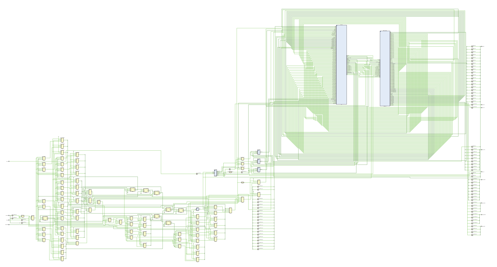
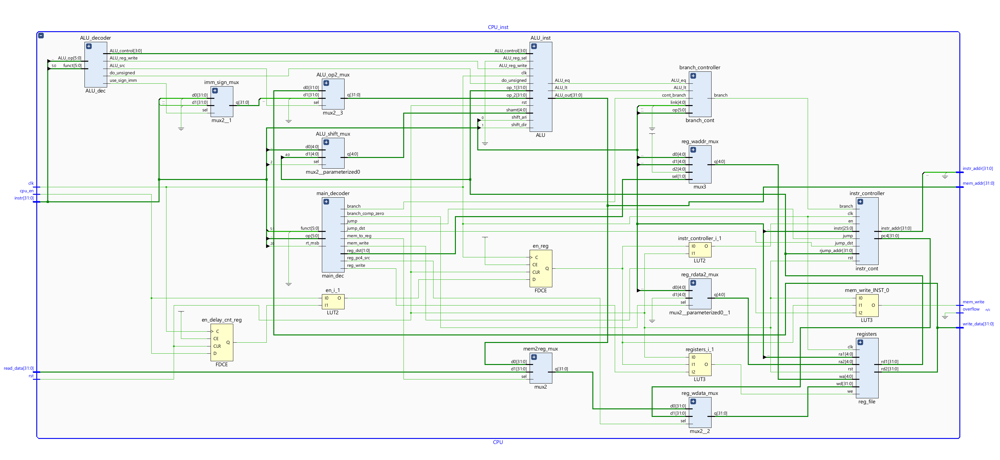
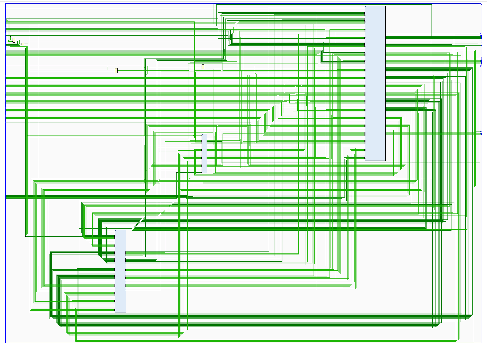

# CS202/CS214 Project Documentation

## Overview

### List of Developers

| SID      | Name        | Workload                                                     | Contribution Ratio |
| -------- | ----------- | ------------------------------------------------------------ | ------------------ |
| 12110804 | FANG Jiawei | CPU Design, Top Design, CPU Testcases, MMIO Controller Design/Driver Design | 34%                |
| 12112104 | CHENG Sizhe | I/O Test                                                     | 33%                |
| 12110947 | CHEN Luyao  | CPU Test, Project Testcase Design                            | 33%                |


### Version Control

Please refer to the GitHub repository: [IskXCr/CS214-Computer-Organization-Project: CS202/CS214 Computer Organization Project (github.com)](https://github.com/IskXCr/CS214-Computer-Organization-Project).


## CPU Architecture

### Characteristics

**This CPU is a complete redesign** with reference structure coming from **only the textbook** with remarkable modification and **codes completely rewritten from scratch without referring to any other code sources but several explanatory articles about decoder**. 

Characteristics of the instruction set are worked out individually by us.


#### List of Supported Instructions (ISA)

This is a subset of the MIPS32 instruction set. Exclusions are coprocessor-0-related instructions, exception handling and ring controls.

(**Bonus**) *This ISA is a **superset** of the Minisys ISA*. We directly compare the ISA here instead of copying-pasting the table twice.

| Type           | Instruction               | Support in *Minisys ISA* |
| -------------- | ------------------------- | ------------------------ |
| Logical        | `and rd, rs, rt`          | Y                        |
|                | `or rd, rs, rt`           | Y                        |
|                | `xor rd, rs, rt`          | Y                        |
|                | `nor rd, rs, rt`          | Y                        |
| Logical-IMM    | `andi rt, rs, immediate`  | Y                        |
|                | `xori rt, rs, immediate`  | Y                        |
|                | `lui rt, immediate`       | Y                        |
|                | `ori rs, rt, immediate`   | Y                        |
| Shift          | `sll rd, rt, sa`          | Y                        |
|                | `srl rd, rt, sa`          | Y                        |
|                | `sra rd, rt, sa`          | Y                        |
| Shift-R        | `sllv rd, rt, rs`         | Y                        |
|                | `srlv rd, rt, rs`         | Y                        |
|                | `srav rd, rt, rs`         | Y                        |
| Data-Transfer  | `mfhi rd`                 | **N**                    |
|                | `mflo rd`                 | **N**                    |
|                | `mthi rs`                 | **N**                    |
|                | `mtlo rs`                 | **N**                    |
| Arithmetic-R   | `add rd, rs, rt`          | Y                        |
|                | `addu rd, rs, rt`         | Y                        |
|                | `sub rd, rs, rt`          | Y                        |
|                | `subu rd, rs, rt`         | Y                        |
|                | `slt rd, rs, rt`          | Y                        |
|                | `sltu rd, rs, rt`         | Y                        |
|                | `mult rs, rt`             | **N**                    |
|                | `multu rs, rt`            | **N**                    |
|                | `div rs, rt`              | **N**                    |
|                | `divu rs, rt`             | **N**                    |
| Arithmetic-IMM | `addi rt, rs, immediate`  | Y                        |
|                | `addiu rt, rs, immediate` | Y                        |
|                | `slti rt, rs, immediate`  | Y                        |
|                | `sltiu rt, rs, immediate` | Y                        |
| Jump-R         | `jr rs`                   | **N**                    |
| Jump-R-Link    | `jalr rs`/`jalr rd, rs`   | **N**                    |
| Jump-IMM       | `j target`                | Y                        |
| Jump-IMM-Link  | `jal target`              | Y                        |
| Branch         | `beq rs, rt, offset`      | Y                        |
|                | `bgtz rs, offset`         | **N**                    |
|                | `blez rs, offset`         | **N**                    |
|                | `bne rs, rt, offset`      | Y                        |
|                | `bltz rs, offset`         | **N**                    |
|                | `bgez rs, offset`         | **N**                    |
| Branch-Link    | `bltzal rs, offset`       | **N**                    |
|                | `bgezal rs, offset`       | **N**                    |
| Load/Store     | `lw rt, offset(base)`     | Y                        |
|                | `sw rt, offset(base)`     | Y                        |

**Optimization on Minisys ISA**: Added support for **significantly more** branch and link instructions, jump register and link **any target register**, and `mul/div` instructions (signed/unsigned) and those related to store/load to/from `hi/lo` registers. 


#### Reference ISA

[MIPS32 Instruction Set Quick Reference](https://s3-eu-west-1.amazonaws.com/downloads-mips/documents/MD00565-2B-MIPS32-QRC-01.01.pdf)

[step_into_mips/指令及对应机器码_2018.pdf at master · lvyufeng/step_into_mips · GitHub](https://github.com/lvyufeng/step_into_mips/blob/master/docs/指令及对应机器码_2018.pdf)


#### CPU Register Specification

| Register Name | Size        | Description                                                  |
| ------------- | ----------- | ------------------------------------------------------------ |
| GPR           | 32 Words    | General Purpose Register. `$zero` fixed. `$sp` initialized to `0x7fffeffc`. |
| PC            | 1 Word      | Program Counter                                              |
| `hi`/`lo`     | 1 Word Each | Used in `mult`/`div` instructions and `mflo/mfhi/mtlo/mthi` instructions |


#### Exception Handler:

No exception handler. Overflow indicator exists *but not used in the demonstration since it is used for 32-bit overflows*.


#### Memory Configuration and Address Space

| Segment | Offset      | ITB? | Boundary    | ITB? | Size        | Source                                     |
| ------- | ----------- | ---- | ----------- | ---- | ----------- | ------------------------------------------ |
| Text    | 0x0040_0000 | Y    | 0x0041_0000 | N    | 16384 Words | Block Memory Generator                     |
| Data    | 0x1001_0000 | Y    | 0x1007_0000 | N    | 98304 Words | Block Memory Generator                     |
| Stack   | 0x7fff_effc | Y    | 0x7ffe_f000 | Y    | 16384 Words | Block Memory Generator                     |
| MMIO    | 0xffff_0000 | Y    | 0xffff_0040 | N    | 16 Words    | Memory-Mapped IO Segment **1**             |
| MMIO    | 0xffff_0100 | Y    | 0xffff_0A60 | N    | 600 Words   | Memory-Mapped IO Segment **2** for **VGA** |

*ITB*: ***Include this boundary***

Block Memory addressing unit: `32 bits`. Truncate 2 bits from the processor to get the actual address inside the block memory.

**Architecture**: Harvard Architecture.


#### IO Specification

IO access method: **MMIO**, polling.

*MMIO* configuration is tailored to meet the requirements for CS214 Project Inspection.

Pin constraints only work only on *Minisys*.

| Physical Segment Base | R/W Support | Size (Word) | Destination Device | Description                                                  |
| --------------------- | ----------- | ----------- | ------------------ | ------------------------------------------------------------ |
| 0xffff_0000           | R/W         | 1           |                    | Reserved                                                     |
| 0xffff_0004           | R           | 1           | SW[23]             | `0` if scenario 1. `1` if scenario 2.                        |
| 0xffff_0008           | R           | 1           | SW[22:20]          | Testcase number, 3 bits.                                     |
| 0xffff_000c           | R           | 1           | SW[15:8]           | Operand 1. Sign extension according to specific testcases.   |
| 0xffff_0010           | R           | 1           | SW[7:0]            | Operand 2. Sign extension according to specific testcases.   |
| 0xffff_0014           | R           | 1           | Keypad             | Keypad number in hex. Maximum 1 word. **Reserved but not implemented.** |
| 0xffff_0018           | R           | 1           | Timer[63:32]       | Timer. Increases 1 every cycle, frequency 100 MHz (relies on `data_clk`), bit-width 64. |
| 0xffff_001c           | R           | 1           | Timer[31:0]        | Timer. Increases 1 every cycle, frequency 100 MHz (relies on `data_clk`), bit-width 64. |
| 0xffff_0020           | R/W         | 1           | LED[19]            | Single LED indicator.                                        |
| 0xffff_0024           | R/W         | 1           | LED[18]            | Single LED indicator                                         |
| 0xffff_0028           | R/W         | 1           | LED[17]            | Single LED indicator                                         |
| 0xffff_002c           | R/W         | 1           | LED[16]            | Single LED indicator                                         |
| 0xffff_0030           | R/W         | 1           | LED Tube LEFT      | 7-seg tube output in hex.                                    |
| 0xffff_0034           | R/W         | 1           | LED Tube RIGHT     | 7-seg tube output in hex.                                    |
| 0xffff_0038           | R/W         | 1           | LED[15:0]          | 16 bit LED output.                                           |
| 0xffff_003C           | R/W         | 1           | Buzzer             | Stores the vibrating frequency of the buzzer. **Reserved but not implemented.** |
| 0xffff_0100           | R/W         | 600         | VGA                | VGA text-mode buffer.                                        |

*R/W support: Read/Write support.*


#### Other characteristics

**CPI**: 1 (single-cycle)

**Pipeline Support**: false. **Pipeline-ready** though as the modular design meets the requirements for transforming this CPU into a pipelined structure.


### CPU Interface

```systemverilog
module CPU #(parameter TEXT_BASE_ADDR = 32'h0040_0000) (
    input  wire clk,               // clock signal
    input  wire rst,               // reset
    
    input  wire cpu_en,            // async enable. This enable signal will be processed 
                                   // by the next clock cycle. Only when this signal is asserted
                                   // will the CPU starts working, otherwise the CPU stalls

    output wire [31:0] instr_addr, // instruction address
    input  wire [31:0] instr,      // instruction data

    output wire mem_write,         // if asserted, write at the specified address
    output wire [31:0] mem_addr,   // memory address to read/write from/to
    output wire [31:0] write_data, // data written to data memory. Valid ONLY IF mem_write is asserted
    input  wire [31:0] read_data,  // data read from data memory

    output wire overflow           // arithmetic overflow indicator
    );
```

The UART ports are specified in the `top.sv` module. Several multiplexers exist to select the data clock from either the CPU clock or the UART write clock. Similar for other UART related ports. Here we take manipulating the **instruction memory** as an example:

```systemverilog
    // set instruction memory
    wire instr_clk;
    wire [31:0] true_instr_addr;
    wire [31:0] instr_write_data;
    wire instr_wen;
    
    assign instr_clk = mode_ctrl ? cpu_clk : uart_write_clk;
    assign true_instr_addr = mode_ctrl ? 
                             (cpu_instr_addr - 32'h0040_0000) : {16'h0000, uart_write_addr, 2'b00};
    assign instr_write_data = uart_write_data;
    assign instr_wen = (~mode_ctrl && ~uart_write_target && uart_wen);
    
                 
    instr_mem instr_memory(.clka(instr_clk),
                           .addra(true_instr_addr[15:2]),
                           .dina(instr_write_data),
                           .douta(cpu_instr),
                           .wea(instr_wen));
```

In our design, I/Os are completely mapped to memory, and CPU only has the ability to read/write from/to the memory, and is completely oblivious of the outer structure. This helps separating the cohesion of the CPU and the I/O part, which in fact facilitates the process of CPU functional verification and I/O design.


Other I/O ports bound to the structure:

| Type (I/O) | Name                  | VarName          | Destination Device | Pin  | Description                                                  |
| ---------- | --------------------- | ---------------- | ------------------ | ---- | ------------------------------------------------------------ |
| I          | Clock Signal          | `clk`            | Wire               | Y18  | **Minisys** *built-in clock signal*.                         |
| I          | UART_RX               | `uart_rx_i`      | Wire               | Y19  | UART input                                                   |
| O          | UART_TX               | `uart_tx_o`      | wire               | V18  | UART output                                                  |
| I          | CPU UART Mode Trigger | `uart_trigger`   | Button[3]          |      | If pressed, switch CPU to UART communication mode.           |
| I          | CPU Work Mode Trigger | `work_trigger`   | Button[2]          |      | If pressed, switch CPU to work mode                          |
| I          | Reset                 | `rst`            | Button[4]          |      | If pressed, initial an complete reset that sets CPU to **work** mode, and resets PC and GPRs to their initial values. |
| O          | CPU Mode Indicator    |                  | LED[23]            |      | If `0`, CPU is in UART communication mode. Else, CPU is in work mode. |
| O          | UART_DONE             |                  | LED[22]            |      | UART transmission done indicator.                            |
| O          | UART_WRITE_ENABLE     | `uart_wen`       | LED[21]            |      | UART write-enable signal indicator.                          |
| O          | INSTR_WEN             | `uart_instr_wen` | LED[20]            |      | UART instruction write-enable signal                         |
| O          | DATA_WEN              | `uart_data_wen`  | LED[19]            |      | UART data write-enable signal                                |


### Overall Internal Structure

#### Overview








- The **first** figure shows the overall structure of the `top` module. There are two noticeable large blocks. **The left one is the CPU** itself, which connects only to an instruction memory and a data multiplexer (selects between `data`, `stack` and `MMIO`). **The right one is the MMIO controller**, which connects to various I/O drivers. 

- The **second** figure shows the overall structure of CPU module. In contrast to the model provided on the textbook, the control unit is split into three submodules, the first one being the **main decoder**, the second one being the **ALU decoder** and the third one being the **branch controller**.

- The **third** figure is a flattened version of the CPU.


For specifications of each submodule, we hereby provide a list of code snippets with comments for understanding the interfaces of these submodules. You may find them inside the code we have provided.

```systemverilog
// ALU decoder
module ALU_dec (
    input  wire [5:0]  ALU_op,     // ALU internal op code
    input  wire [5:0]  funct,      // function code

    output wire shift_src,         // 1 for selecting the register rs
    output wire shift_dir,         // 1 for right shift
    output wire shift_ari,         // 1 for arithmetic shift
    output wire do_unsigned,       // 1 to do unsigned operation

    output wire ALU_src,           // 1 to use the immediate
    output wire use_sign_imm,      // 1 to use the signed_immediate instead of the unsigned

    output wire ALU_reg_write,     // 1 to let ALU write results into hi/lo register
    output wire ALU_reg_sel,       // 0 for selecting the hi register, 1 for selecting the lo register

    output reg  [3:0]  ALU_control
    );
    /* ignored */
endmodule

// ALU
module ALU (
    input  wire clk,
    input  wire rst,

    input  wire [3:0] ALU_control,  // ALU internal control code
    input  wire [4:0] shamt,        // shift amount
    input  wire shift_dir,          // 1 for right shift
    input  wire shift_ari,          // 1 for arithmetic shift
    input  wire do_unsigned,        // 1 to do unsigned operation

    input  wire ALU_reg_write,     // 1 to let ALU write results into hi/lo register
    input  wire ALU_reg_sel,       // 0 for selecting the hi register, 1 for selecting the lo register

    input  wire [31:0] op_1,
    input  wire [31:0] op_2,
    
    output wire ALU_eq,             // if high, op_1 is equal to op_2
    output reg  ALU_lt,             // if high, op_1 is less than op_2
    output reg  overflow,           // if set, the arithmetic result causes an overflow
    output reg  [31:0] ALU_out
    );

    // wires and regs
    wire [31:0] shift_res;

    wire [63:0] mul_res;
    wire [31:0] div_quot, div_rem; // quotient and remainder, as suggested
    reg  [31:0] hi, lo;            // hi and lo register

    reg  [31:0] op_res;            // intermediate arithmetic results other than op shift and mul/div
    /* ignored */
endmodule

// Branch Controller
// The separation of the branch controller allows early branching
// inside a pipelined design.
module branch_cont (
    input  wire cont_branch,
    input  wire [5:0] op,
    input  wire [4:0] link,  // instr[20:16]

    input  wire ALU_lt,      // as described before
    input  wire ALU_eq,      // as described before

    output reg  branch
    );
    /* ignored */
endmodule

// Instruction controller
module instr_cont #(parameter TEXT_BASE_ADDR = 32'h0040_0000) (
    input  wire clk,
    input  wire rst,
    input  wire en,  // if not enabled, the current instruction address is frozen

    output wire [31:0] pc4,        // PC+4 for linking purposes
    output wire [31:0] instr_addr, // address of the next instruction to fetch
    input  wire [25:0] instr,      // the current instruction
    input  wire [31:0] rjump_addr, // register jump addr

    input  wire jump,              // if asserted, initiate a jump
    input  wire jump_dst,          // if asserted, do jump on the register
    input  wire branch             // if asserted, initiate a branch
    );
    /* ignored */
endmodule

// Main decoder
module main_dec(
    input  wire [5:0] op,
    input  wire rt_msb,           // used when determined whether to link register
    input  wire [5:0] funct,      // funct field of the instruction

    output wire mem_to_reg,       // if asserted, write register using output from the 
                                  // memory
    output wire mem_write,        // if asserted, write to memory
    output wire branch,           // if asserted, do branching
    output wire branch_comp_zero, // if asserted, force the second operand to be $zero
    output wire reg_write,        // if asserted, the register file overwrites the content
                                  // pointed by the current write_addr
    output wire [1:0] reg_dst,    // 0 - rt, 1 - rd, 2 - ra
    output wire reg_pc4_src,      // if asserted, select PC+4 as write_data to the register
    output wire jump,             // if asserted, initiate a jump
    output wire jump_dst          // if asserted, select a register as the jump destination
    );
    /* ignored */
endmodule

// Program Counter
module PC #(parameter TEXT_BASE_ADDR = 32'h0040_0000) (
    input  wire clk,
    input  wire rst,
    input  wire en,        // if not asserted, freeze the current address
    input  wire [31:0] d,  // input address, flushed to the internal register at posedge clk
    output reg  [31:0] q   // output current address
    );
    /* ignored */
endmodule

// do shifts. Separated from ALU for abstraction.
module shifter(
    input  wire [31:0] d,     // data
    input  wire [4:0]  shamt, // shift amount
    input  wire dir,          // if asserted, shift right
    input  wire ari,          // if asserted, do arithmetic shift

    output reg  [31:0] q
    );
    /* ignored */
endmodule
```


For **MMIO**, please refer to the MMIO specification described before.


**Architecture**: Harvard Architecture.


#### List of Submodules

| Module Name         | Module Definition | Description                                                  | I/O  |
| ------------------- | ----------------- | ------------------------------------------------------------ | ---- |
| `ALU_decoder`       | `ALU_dec.sv`      | Decoder parsing instructions into ALU control signals, including `ALU_op`, parameters to control `shift`, unsigned operations, use of signed/unsigned immediate, source of the `ALU` operand. |      |
| `imm_sign_mux`      | `mux2.sv`         | Select between the signed immediate and the unsigned immediate, determined by `use_sign_imm` signal from `ALU_decoder`. |      |
| `ALU_op2_mux`       | `mux2.sv`         | Select the secondary operand of `ALU` between the register value and the immediate, determined by `ALU_sc`. |      |
| `ALU_shift_mux`     | `mux2.sv`         | Select the source for `shift amount` for ALU.  Either from `shamt` field of the instruction, or from `rs`. |      |
| `main_decoder`      | `main_dec.sv`     | Decoding the instruction and set various fields, including `branch`, `branch_comp_zero` (*used in branches that compares to zero but has a different field other than `5'b00000` in `rt`*), `jump`, `jump_dst` (*used if jump to an address specified in a register*), `mem_to_reg`, `mem_write`, `reg_dst` (*select the write address of the register file. Used to select between `rt`, `rd` and `$ra` (used for linking)*), `reg_pc4_src` (*for linking*), `reg_write`, etc. |      |
| `ALU_inst`          | `ALU.sv`          | ALU for processing various kind of operations.               |      |
| `reg_rdata2_mux`    | `mux2.sv`         | Select between `$zero` and `$rt`. Used in branching instructions. |      |
| `reg_waddr_mux`     | `mux3.sv`         | Select between different write addresses. Used in branching, jumping and linking. |      |
| `branch_controller` | `branch_cont.sv`  | Used to control the branch behavior, based on `ALU_lt` and `ALU_eq` which are two ALU facilities for comparing its operands. |      |
| `instr_controller`  | `instr_cont.sv`   | Used to control the instruction flow. Accepts `jump` and `branch` signals, and determine whether to jump/branch according to `main_decoder` and `branch_controller`. `instr_addr` outputs the address of the instruction to fetch, and `pc4` outputs the value of current `PC` +4 (*for linking purposes*). |      |
| `registers`         | `reg_file.sv`     | Register files. Has a reset button to reset contents to their default values. |      |


*For detailed I/O specification on each submodule, please refer to the schematic image. The naming convention is designed to be easy to read.*


#### ALU OpCode Table

| Name      | OpCode Hex |
| --------- | ---------- |
| nop       | 0          |
| and       | 1          |
| or        | 2          |
| xor       | 3          |
| nor       | 4          |
| lui       | 5          |
| shift     | 6          |
| add       | 7          |
| sub       | 8          |
| slt       | 9          |
| mult      | A          |
| div       | B          |
| mfhi/mflo | C          |


#### ALU Utility Ports

| I/O  | Port Name     | Description                                                  |
| ---- | ------------- | ------------------------------------------------------------ |
| I    | ALU_control   | Accepts ALU OpCode                                           |
| I    | shamt         | Shift amount                                                 |
| I    | shift_dir     | Shift direction                                              |
| I    | shift_ari     | Shift arithmetic (right shift support ONLY)                  |
| I    | do_unsigned   | Do unsigned operations (all operations that requires sign-extension or signed-number comparison) |
| I    | ALU_reg_write | 1 to let ALU write results into `hi`/`lo` register           |
| I    | ALU_reg_sel   | 0 for selecting the `hi` register, `1` for selecting the `lo` register |
| O    | ALU_out       | Result of the ALU operation                                  |
| O    | overflow      | Whether the operation (arithmetic only) results in an overflow |
| O    | ALU_eq        | Whether `op_1 == op_2`                                       |
| O    | ALU_lt        | Whether `op_1 < op_2`                                        |


#### Combining Instructions and Optimizing for Performance

###### Operational Characteristics from Instruction Encoding

| Var                       | Asserted                                               | Not Asserted            |
| ------------------------- | ------------------------------------------------------ | ----------------------- |
| funct[0]                  | do unsigned operation if arithmetic                    |                         |
| funct[0]                  | if shift, do arithmetic shift                          |                         |
| funct[1]                  | if shift, do right shift                               | if shift, do left shift |
| funct[2]                  | if shift, select the shift source as the register `rs` |                         |
| funct                     | if `6'b001000` or `6'b001001`, link `$ra` and jump     |                         |
| funct[0] & funct[5]       | if R-type, do unsigned operation                       |                         |
| op[0]                     | if memory access, access halfword                      |                         |
| op[0]                     | if jump to `instr_index`, link `$ra`                   |                         |
| op[1]                     | word                                                   |                         |
| (op[2] & ~op[3]) \| op[5] | do sign-extension on the immediate                     |                         |
| op[3] \| op[5]            | Select the immediate as the second operand of ALU      |                         |
| op[3] & op[0]             | if I-type, do unsigned operation                       |                         |
| op[3]                     | if memory access, do store                             |                         |
| op[5]                     | memory access                                          |                         |
| rt[5]                     | if branch, link `$ra`                                  |                         |


## Integrated Tests and Results

| Test Suite        | Test File           | Test Subject                                                 | Type       | Result        |
| ----------------- | ------------------- | ------------------------------------------------------------ | ---------- | ------------- |
| CPU_UNIT_TEST     | cpu_reset_sim.sv    | Test resetting the CPU and checks whether the state machine correctly transforms from `stall` to `enabling` and then `enabled`. | Unit       | Passed        |
|                   | mode_switch_sim.sv  | Test whether the `top` module successfully switches states between UART communication mode and CPU work mode. | Unit       | Passed        |
|                   | tube_driver_test.sv | Tests the functionality of the 7-seg tube driver             | Unit       | Passed        |
|                   | VGA_text_sim.sv     | Tests the functionality of the VGA textmode driver           | Unit       | Passed        |
| SIM_CPU_TEST      | sim_test_1.asm      | Arithmetic and Logical Operations                            | Integrated | Passed        |
|                   | sim_test_2.asm      | Data Segment and S/W Operations                              | Integrated | Passed        |
|                   | sim_test_3.asm      | Branch and link instructions, with other stuff               | Integrated | Passed        |
|                   | sim_test_4.asm      | Interrupt Call and Stack Frame Pointer                       | Integrated | **Cancelled** |
|                   | sim_test_5.asm      | slt, sltu                                                    | Integrated | Passed        |
| UART_TEST         | uart_test_1.asm     | UART communication                                           | Integrated | Passed        |
| VIDEO_TEST        | video_test_1.asm    | Video memory functionality and VGA driver                    | Integrated | Passed        |
|                   | video_test_2.asm    | Character set availability                                   | Integrated | Passed        |
| LOGICAL_TEST      | logical_test_1.asm  | `mult`, `div`, `mflo/mfhi/mtlo/mthi` test                    | Integrated | Passed        |
| IO_TEST           | io_test_1.asm       | 7-seg tube MMIO and CPU status                               | Integrated | Passed        |
|                   | io_test_2.asm       | 7-seg tube MMIO and MMIO address                             | Integrated | Passed        |
|                   |                     |                                                              |            |               |
| VIDEO_PLAYER_TEST | video_player.asm    | CPU **overall functionality** test, including branch/jump, every bit operations except for `mul/div`, encoding/decoding and MMIO access. | Integrated | Passed        |

For test files, please refer to files under  `./assembly/` directory, which includes MIPS assemblies used to test the functionality. For simulation environments we have built, please refer to `./sim/`.


## Bonus Part

**All testing files and results for bonus are included in the previous part in which tests are discussed**. Please consult the previous part of this document. 

**We describe the utilities used in verfication in the last section of this part.** Sources of these utilities can be found under `./utils/` folder.

**As expanding the details of each bonus part is tedious and may span 10~12 pages, we only describe the essentials here**.


### I/O: VGA Text Mode Driver Support and other stuff

In this project we provide a VGA driver that supports displaying built-in characters using `CP885.F16` font set (which was used in early DOS machines). This driver is placed under `./src/IO/drivers/output/VGA_drv/` folder, **and can be used separately for any other projects.** We make it public on GitHub, so that students enrolled in CS202/CS214 in the future may utilize these drivers to realize some cool stuff without much tuning.

We recommend to use software vertical sync to avoid image tearing.

To avoid filling the entire document with redundant details, we only list some specifications there.


#### VGA Text Mode Specification

| Variable                     | Value   | Description |
| ---------------------------- | ------- | ----------- |
| `text_width`                 | 8       |             |
| `text_height`                | 16      |             |
| `horizontal_character_count` | 80      |             |
| `vertical_character_count`   | 30      |             |
| `total_character_count`      | 2400    |             |
| `colored_output`             | `false` |             |
| `refresh_rate`               | 60 Hz   |             |


Please see `src/IO/output/VGA_drv` (a separated module that can be used individually).

Supports `80*30` text resolution using `CP885.F16` as the character set.

Buffer `80*30`, write bit-width `32` bit, byte-order little-endian.

Internally uses a font memory that initializes from `coe/CP885.F16.coe`. A font converter is provided in the utility folder.


#### Mechanism

VGA text-mode is implemented by providing a font memory, a signal synchronization module and a VGA text buffer.


As suggested, this VGA buffer can be written/read directly by the CPU. Simultaneously, the **VGA text controller** reads contents inside the VGA text buffer and determines which character to draw (or nothing will be drawn). By carefully designing the state and prefetching position of the VGA signal, the text can be displayed smoothly and without tearing (under 60 hertz).


### ISA eXtension: Multiplication/Division, Branch-And-Link, Jump Register (and Link)

We have **already compared the difference** between this ISA and the *Minisys* ISA before. For difference in ISA please therefore refer to the earlier part of this document.

| Type          | Instruction             | Support in *Minisys ISA* |
| ------------- | ----------------------- | ------------------------ |
| Data-Transfer | `mfhi rd`               | **N**                    |
|               | `mflo rd`               | **N**                    |
|               | `mthi rs`               | **N**                    |
|               | `mtlo rs`               | **N**                    |
|               | `mult rs, rt`           | **N**                    |
|               | `multu rs, rt`          | **N**                    |
|               | `div rs, rt`            | **N**                    |
|               | `divu rs, rt`           | **N**                    |
| Jump-R        | `jr rs`                 | **N**                    |
| Jump-R-Link   | `jalr rs`/`jalr rd, rs` | **N**                    |
|               | `bgtz rs, offset`       | **N**                    |
|               | `blez rs, offset`       | **N**                    |
|               | `bltz rs, offset`       | **N**                    |
|               | `bgez rs, offset`       | **N**                    |
| Branch-Link   | `bltzal rs, offset`     | **N**                    |
|               | `bgezal rs, offset`     | **N**                    |


#### Multiplication/Division

Extending the multiplication/division instructions, and support for R/W operations on `hi/lo` registers requires adding a clock signal and a reset signal to the ALU. On every `posedge` of the clock signal, the `hi/lo` registers are updated according to the previous instruction. 

`ALU_reg_write` and `ALU_reg_sel` determines whether to write these two registers and the specific target register. **ALU OpCode Table** is also updated for these additional instructions. No significant modification needs to be done except for the ALU decoder.

| Name      | OpCode Hex |
| --------- | ---------- |
| mult      | A          |
| div       | B          |
| mfhi/mflo | C          |

Their implementation can be inspected in the code provided.

```systemverilog
// manipulate hi/lo registers
always_ff @(posedge clk, posedge rst) begin
    if (rst) begin
        hi <= 32'h0000_0000;
        lo <= 32'h0000_0000;
    end
    else begin
        case (ALU_control)
            4'hA: begin
                hi <= mul_res[63:32];
                lo <= mul_res[31:0];
            end
            4'hB: begin
                hi <= div_rem;
                lo <= div_quot;
            end
            default: begin
                hi <= (ALU_reg_write && ~ALU_reg_sel) ? op_1 : hi;
                lo <= (ALU_reg_write && ALU_reg_sel) ? op_1 : lo;
            end
        endcase
    end
end
```


#### Branch-And-Link & Jump

**8 additional branch and jump instructions are added**. 

To manage them, a separate **branch controller** has been added. The branch controller controls whether to branch by examining the relation between two input operands of ALU. Furthermore, several multiplexers are added to the input of the register file to control which register to write including `$ra`. The program counter also outputs the value of `PC+4` for linking purposes.

For some of the instructions that compares to zero but has a nonzero `rt` operand, they are specially treated **inside the main decoder**. Please refer to the code as **it is written for clarity.**


Their implementation can be inspected in the code provided.


### Combining Hardware/Software Interface


We have designed an ASCII animation that can be played on our implementation. This assembly file `./assembly/video_player` tests nearly every **instruction type** (not every instructions) our CPU has implemented and the output devices we have used. 

This simple decoder FSM parses a custom video format and displays real-time status on both the screen and tube-driver output.

We first designed a Simple ASCII Video Format, or **SAVF**. The specification is listed as follows (you may also find them under `./doc/` folder):


#### SAVF-Requirements

The stream can be generated by any ASCII character utility.

Character set: (the last one is a *space character*, a total of 16 characters.)

```
M@W08Za2S7ri:;. 
```


#### SAVF-Specification

**Resolution**: Fixed **40*16**, at any frame rate.

**Header**: SAVF has no video header but a terminating frame, indicated by an invalid frame header.


| Hex Code | 0       | 1    | 2    | 3    | 4    | 5    | 6    | 7    | 8    | 9    | A    | B    | C    | D    | E    | F    |
| -------- | ------- | ---- | ---- | ---- | ---- | ---- | ---- | ---- | ---- | ---- | ---- | ---- | ---- | ---- | ---- | ---- |
| Original | *Space* | M    | @    | W    | 0    | 8    | Z    | a    | 2    | S    | 7    | r    | i    | :    | ;    | .    |


#### SAVF-Frames

Frames are of two categories:

| Name        | Code    | Code | Description                                                  |
| ----------- | ------- | ---- | ------------------------------------------------------------ |
| Key Frame   | [**K**] | 1    | Key frame that is followed by a list of mapping entries and captures the entire frame in compressed format |
| Delta Frame | [**D**] | 0    | Delta frame that modifies the previous frame to generate a new frame |

**Each frame must be aligned on a 32-bit boundary.**

The byte order is *little-endian*, following the convention of MARS and the toolsets included in this repository.

```
31 (MSB)                     (LSB) 0
|----------------------------------|
| entry n | .... | entry2 | entry1 |
|----------------------------------|
```


##### 1. Key Frame

##### Key Frame Header:  (32 bit)

| Bit Offset (LSB) | Boundary | Type              | Description                                           |
| ---------------- | -------- | ----------------- | ----------------------------------------------------- |
| 31               | 31       | 32-bit Identifier | `0` for **D** and `1` for **K**                       |
| 0                | 30       | Reserved          | Must be `0`. If full `1`, then this is the last frame |


##### 2. Delta Frame

##### Delta Frame Header: (16 bit)

| Bit Offset (LSB) | Boundary | Type               | Description                                                  |
| ---------------- | -------- | ------------------ | ------------------------------------------------------------ |
| 15               | 15       | 32-bit Identifier  | `0` for **D** and `1` for **K**                              |
| 0                | 14       | #Delta Entry Count | Number of entries that records a modification to the previous frame. If `0` then this frame completely the same as the previous one. |

*The identifier is chosen to be 0 here for quick processing.*


##### Delta Frame Entry  (16 bit)

| Bit Offset (LSB) | Boundary | Name     | Description                      |
| ---------------- | -------- | -------- | -------------------------------- |
| 10               | 15       | Y-offset | Y-axis offset, from `0` to `64`. |
| 4                | 9        | X-offset | X-axis offset, from `0` to `64`. |
| 0                | 3        | Char     | Character in 4 bits              |


#### Decoder, Verification Software and Other Utilities

Utilities are placed under `./utils/` folder.

- for usages of those utilities, please: 
  - run with `-h` option if it is written in Python and with source code
  - or refer to the comment within. ***Functions inside the code are provided with detailed comments on how they operate.***


##### ASCII Art Generator

Please refer to [ascgen2's official website](http://sourceforge.net/projects/ascgen2/) to get the executable.


##### ASM -> COE/UART Data Conversion

`asm_conv/rawhex2coe.py`: Generate COE file from raw file produced by MARS (dump to ... in **hexadecimal text**)

`asm_conv/uart_text_gen.py`: Generate UART text file by combining two COE files (text/data) produced by `rawhex2coe.py`.


##### Font Generator

`font_gen/bin2coe.py`: Convert font from binary bitmap format (used by VGA BIOS) to a `coe` file loaded into a block memory generator. Currently, conversion can only be done on `8*16` fonts. However, you may modify the parameters to suit your need.


#### Video Encoder

`savf_conv/savf_encoder.py`: Convert an ASCII video into a compressed byte stream. Conversion can only be done on `40x16` sized frames. **Real-time Preview** and verification can be done inside the utility by invoking particular functions. For details, please consult the source code, as it is well-documented. **Output byte stream to COE is also possible.**


## Problems and Summary

### Problems

Most of the time, errors comes from the assembly code rather than the CPU.


### Summary

To design the CPU and write from scratch without referring to other source code requires detailed planning and functional verification. Also, it is tedious to deal with the details of `posedge`/`negedge` , which requires a clear understanding of the `verilog` code you have written.

We have switched to `SystemVerilog` for a clearer structure. In `SystemVerilog`, the type of each `always` block can be specified using `always_comb` (combinatorial), `always_ff` (flip-flop) and `always_latch` (latch). If the actual implementation varies from your specified type, **Vivado warns you about it** (which is pretty useful, because something unexpected happen).

To write something that is actually cool requires a lot of effort, and the result almost always comes from hard-work and detailed inspection.

Simulations are useful when you doubt the functionality of the CPU, but most of the time errors hides within the assembly code you've written.
